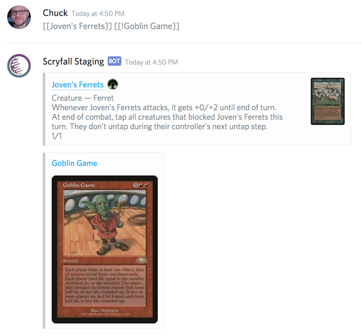
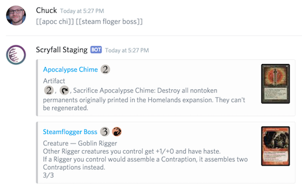
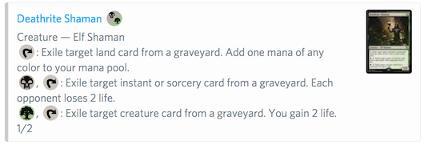
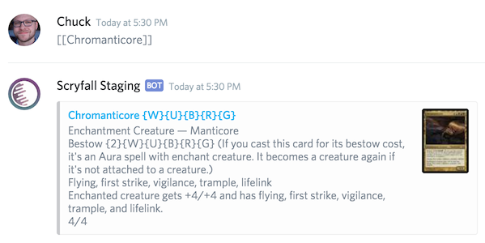

# Servo

Servo is a Discord bot that will post the Oracle text or image of a _Magic: the Gathering_ card to your text channels when a card name is referenced.

## Usage

You must have the _Manage Server_ permission to add Servo to your Discord server.

The bot will appear as a user and join your text channels. If your Discord server restricts users from chatting by default, you will also need to grant the bot a role that allows it to speak.

## Features

While chatting, surround a Magic card names with brackets (`[[` and `]]`) and prepend with an optional token. Servo will print out the text of that card or its image:

| Command               | Function                                        |
|-----------------------|-------------------------------------------------|
| `[[Joven's Ferrets]]` | Show a text representation of Joven's Ferrets.  |
| `[[!Goblin Game]]`    | Show a picture of Goblin Game.                  |

Servo will also handle misspellings and partial card names, as long as there is a clear match:

### Manamoji

Servo ships with a set of images that can be used as [custom emoji](https://support.discordapp.com/hc/en-us/articles/207619737-Adding-Emoji-Magic) to change text-only mana symbols into colorful images. Discord limits you to 50 custom emoji, so you'll have to choose which ones are most appropriate for your users.

Without manamoji, card symbols will be shown in braces, like they appear in the _Magic_ rules:

